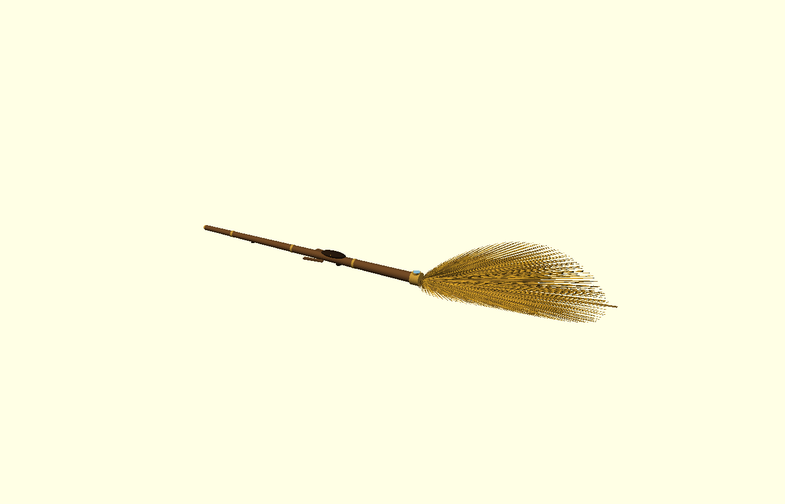

# 🧹 NIMBUS-9¾ — Hardware Full-Stack

> The flight software was the brain. **This is the body.** A bill of materials,
> parametric OpenSCAD CAD, a PDF drawing package, *and* the two things that make
> it a real product and not a render: a **flight + thermal budget that closes**,
> and a **firmware HAL** that lets the existing `nimbus_fc` stack actually drive
> the hardware.
>
> Every dimension here ties back to a number the software already flies with
> (`broom/nimbus_fc/...`). The hardware isn't decoration on the sim — it's the
> same airframe, in atoms.

```
hardware/
  cad/            parametric OpenSCAD models (broom + 3 balls) + lib/
  bom/            per-part CSV bills of materials + SUMMARY.csv rollup
  firmware/       hal.py (software<->stick bridge + thermal governor) + pinmap.csv
  analysis/       flight_thermal.py — does a broomstick actually fly + stay cool?
  scripts/        render.sh (CAD -> PNG), make_pdf.py (drawing package)
  drawings/       the committed PDF drawing package  (generated)
  renders/        committed hero renders + sheet previews (generated)
  Makefile        make check | cad | pdf | all
```

---

## The design call: preserve the silhouette, hide the engineering

The reference is a **broom**: a thin handle and a full bristle leaf. So that's
what the hardware *is* — no pods, no outriggers, no helicopter. The ducted fans
live **inside the shaft and the bristle shroud** (prop exposure 0). Same rule for
the balls: outside is a soft padded shell, inside is the swarm.

| Part | Canon shape kept | Where the drive hides | True to software |
|------|------------------|-----------------------|------------------|
| **Broom** | thin handle + bristle leaf | 8 EDFs in shaft + bristle shroud | `core/params.py` fan layout, mass, battery |
| **Golden Snitch** | walnut sphere **+ real wings** | 4 micro-EDF swarm core | `ball/params.py snitch` (R 0.04 m, 50 g) |
| **Bludger** | black iron-look sphere | 4 EDF swarm core | `ball/params.py bludger` (R 0.15 m) |
| **Quaffle** | red grippy sphere | 4 EDF swarm core | `ball/params.py quaffle` (R 0.18 m) |



### The Snitch's open secret 🤫
The Snitch is the one canon ball with wings, so it gets **real flapping ones** on
coreless gearmotors — thin enough to genuinely flutter. The official story is
that the wings make it fly. They don't; the internal micro-EDF swarm does
(`bom/snitch_bom.csv` SNT-02/03 vs SNT-05). The wings are theatre. *Do not
explain this to Potterheads.*

---

## Does a broomstick actually fly? (the honest part)

A bare stick has almost no disc area, so we did the real budget instead of
hand-waving. `make check`:

```
[1] THRUST     T/W 2.45  -> hovers at 41% throttle           PASS
[2] POWER      no disc area -> 5.1 kPa disc loading, ~106 kW hover draw
[3] ENDURANCE  ~89 s per charge  -> a SPRINTER, by design (hot-swap pits)
[4] THERMAL    19 kW waste heat vs 324 kW air-cooling -> 17x margin  PASS
VERDICT: the budget CLOSES. It flies, and it does not melt.
```

Two honest conclusions, both already handled by the existing software:

- **Endurance is short** because the broom shape has no disc area. That's *fine*:
  the league runs F1-style hot-swap pits, and `nimbus_fc` already forces
  Return-To-Pit at 30 % SoC (`batt_rtp_soc`). The shape costs endurance; we pit.
- **Heat is the real trap** of stuffing high-RPM fans into a thin shaft. Solved
  by not sealing them: the **lift air is the coolant** (motors sit in the duct
  flow), with **heat pipes** spreading the rest over the 2.4 m shaft, and a
  **thermal governor** that derates thrust before the windings cook.

---

## Software ↔ stick: the HAL

`nimbus_fc` ends at the mixer, which emits a per-fan thrust command in **newtons**.
`firmware/hal.py` is the skin that turns those into **DShot** frames for the ESCs,
ingests the sensors back, and runs the **thermal governor**. `make check` runs its
self-test:

```
nimbus_hal self-test (8 fans, one at 113 C)
  DShot frame     : [1338, 1338, 1338, 1957, ...]
  governor active : True (fan 3 derated to 76% authority -> clamped)
  total thrust    : ... N  (weight to beat: 1177 N)
```

The hard real-time cascade stays in the **Rust core** (`rust/nimbus_core`, on the
Cortex-M4F); the HAL is the I/O around it. Pin/protocol map: `firmware/pinmap.csv`.

---

## Build it

```bash
# engineering checks (pure python, no deps)
make check

# CAD renders  (needs openscad; auto-uses xvfb when headless)
make cad

# the PDF drawing package + BOM rollup  (needs matplotlib)
make pdf      # -> drawings/NIMBUS_hardware_drawings.pdf

make all      # everything
```

OpenSCAD models are parametric — open any `cad/*.scad`, set `cutaway=true` to
reveal the internals (`make cad` renders both).

---

## Bill of materials

Per-part CSVs in `bom/`, each line cross-linked to the software module it serves.
`scripts/make_pdf.py` rolls them into `bom/SUMMARY.csv` — the hardware for one full
7-v-7 match (14 brooms + 1 quaffle + 2 bludgers + 1 snitch). See the drawing
package's final sheet for the costed rollup.

> *"Magic? No. We just wrote the collision-avoidance really well — and then we
> built the broom that runs it."*
